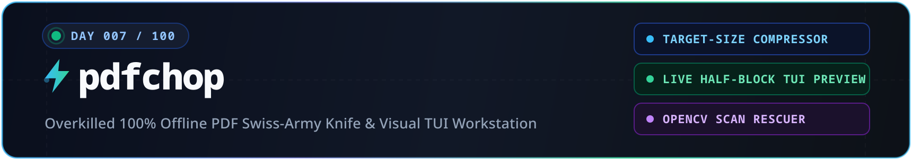
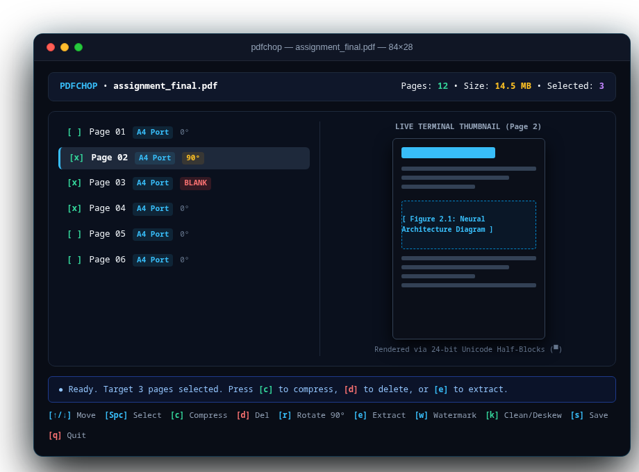
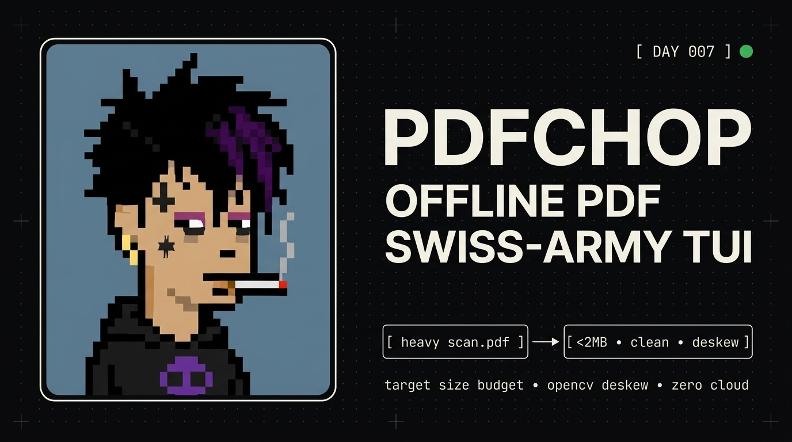

<div align="center">



<p align="center">
  <a href="https://github.com/aotlover9-base-eth/100-days-100-problems-100-solutions"></a>
  
  
  
  
</p>

<p align="center">
  <a href="#quickstart"><b>Quickstart</b></a> &nbsp;•&nbsp;
  <a href="#command-cheat-sheet"><b>Command Cheat Sheet</b></a> &nbsp;•&nbsp;
  <a href="#interactive-tui-controls"><b>TUI Controls</b></a> &nbsp;•&nbsp;
  <a href="#under-the-hood-technical-architecture"><b>Architecture</b></a>
</p>



</div>

## Quickstart

```bash
# 1-second automated install
curl -fsSL https://raw.githubusercontent.com/aotlover9-base-eth/pdfchop/main/install.sh | bash

# Launch zero-flicker TUI with live terminal visual preview
pdfchop document.pdf

# Compress under strict portal size limit (e.g. < 2MB or < 500KB)
pdfchop compress assignment.pdf --max 2MB

# Slice & merge recipes from multiple documents
pdfchop merge "ch1.pdf:1-5" "ch2.pdf:10-15" "notes.pdf:all" -o packet.pdf

# Auto-deskew tilted mobile photos & eliminate page shadows with OpenCV
pdfchop clean scan.pdf --binarize

# Extract specific page ranges
pdfchop extract lecture.pdf -p "1-4, 8, 12-end" -o study_guide.pdf
```

---

## Command Cheat Sheet

| Command | Action |
|:---|:---|
| `pdfchop file.pdf` | Launch interactive TUI with live visual half-block page preview |
| `pdfchop compress file.pdf --max 2MB` | Adaptive target-size byte compression (guarantees `< 2MB`) |
| `pdfchop merge doc1.pdf:1-3 doc2.pdf -o out.pdf` | Merge files with page-level recipes & auto Table of Contents |
| `pdfchop extract file.pdf -p "1-3, 5, 8-end"` | Extract arbitrary page ranges, odd, even, or reverse subsets |
| `pdfchop split file.pdf --burst` | Burst every page into standalone 1-page PDF files |
| `pdfchop split file.pdf --every 5` | Split document into chunks of 5 pages each |
| `pdfchop clean scan.pdf` | Auto-deskew angle correction and mobile camera shadow removal |
| `pdfchop clean scan.pdf --binarize` | High-contrast binarization (pure white background, sharp dark text) |
| `pdfchop drop file.pdf -p "2, 4"` | Delete specific pages from document |
| `pdfchop drop-blank file.pdf` | Detect and purge blank scanner feeder pages |
| `pdfchop rotate file.pdf --deg 90 -p "1, 3"` | Rotate pages by 90°, 180°, or 270° |
| `pdfchop reverse file.pdf` | Reverse entire document page order |
| `pdfchop watermark file.pdf --text "DRAFT"` | Stamp diagonal translucent watermark across pages |
| `pdfchop number file.pdf --skip-first` | Stamp Bates page numbers (`Page X of Y`), skipping cover |
| `pdfchop stamp file.pdf --image sig.png` | Overlay signature or official seal stamp on last page |
| `pdfchop unlock file.pdf -p "pass"` | Permanently decrypt and strip all permission locks |
| `pdfchop lock file.pdf -p "pass" --no-copy` | Encrypt document with AES-256 standard encryption |
| `pdfchop sanitize file.pdf` | Wipe author names, printer metadata, GPS tags, and XMP streams |
| `pdfchop to-images file.pdf --dpi 150` | Export each page as PNG/JPEG image files |
| `pdfchop from-images ./photos/*.jpg -o out.pdf` | Compile images into uniform, auto-centered A4 PDF |
| `pdfchop text file.pdf -o notes.md` | Extract clean text formatted into Markdown |
| `pdfchop inspect file.pdf` | Inspect PDF version, encryption, page geometry & character counts |

---

## Interactive TUI Controls

| Key | Action |
|:---:|:---|
| `↑ / ↓` or `j / k` | Navigate through pages (updates live thumbnail preview dynamically) |
| `[Space]` | Toggle checkbox selection on current page |
| `a` | Select all / Deselect all pages |
| `c` | Open **Target-Size Compressor** dialog (`2MB`, `500KB`, or auto) |
| `d` | Delete selected pages with confirmation prompt |
| `r` | Rotate selected or active page by 90° clockwise |
| `e` | Extract selected pages into a new PDF |
| `w` | Add custom watermark text modal |
| `k` | Run OpenCV auto-deskew and shadow cleanup |
| `n` | Stamp Bates page numbers |
| `s` | Save document copy |
| `q` or `Esc` | Quit / Cancel |

---

## Installation

### 1-Line Automated Installer
```bash
curl -fsSL https://raw.githubusercontent.com/aotlover9-base-eth/pdfchop/main/install.sh | bash
```

### Via Pip / Pipx
```bash
pip install git+https://github.com/aotlover9-base-eth/pdfchop.git
```

### From Source
```bash
git clone https://github.com/aotlover9-base-eth/pdfchop.git
cd pdfchop && pip install -e .
```

---

## Under The Hood (Technical Architecture)

```text
 ┌────────────────────────────────────────────────────────────────────────┐
 │                      pdfchop Engineering Core                          │
 ├──────────────────────────────────┬─────────────────────────────────────┤
 │    Zero-Flicker Terminal TUI     │    High-Performance PDF Engine      │
 │  - Raw unbuffered input (termios)│  - PyMuPDF C++ Core (MuPDF 1.28+)   │
 │  - 24-bit Truecolor Half-Blocks  │  - Zero intermediate disk scratch   │
 │  - Atomic cursor-home redraws    │  - Sub-second execution speeds      │
 ├──────────────────────────────────┴─────────────────────────────────────┤
 │                         Computer Vision & Image                        │
 │  - OpenCV minAreaRect / Hough Line skew angle detection                │
 │  - Morphological illumination estimation for mobile camera shadows     │
 │  - Adaptive bicubic downsampling with binary-search JPEG quantization  │
 └────────────────────────────────────────────────────────────────────────┘
```

### 1. Smart Target-Size Byte Budget Compressor
Portal file limits (e.g., college portals rejecting files $>2\text{ MB}$, email $>20\text{ MB}$) require exact byte budget guarantees:
1. **Stage 1 (Lossless)**: Stream deflating (`zlib`), redundant font subsets, unreferenced XObjects, and structural garbage collection (`garbage=4`). If $\text{size} \le \text{target}$, terminates immediately.
2. **Stage 2 (Bicubic Image Downsampling)**: Extracts raster images and scales resolution (300 DPI $\to$ 150 DPI $\to$ 96 DPI).
3. **Stage 3 (Adaptive Binary Search Quantization)**: Re-encodes embedded image streams with Pillow/JPEG quantization ($Q=80 \to 60 \to 40 \to 25$) and rewrites internal PDF dictionary xref streams until the file fits strictly under the target ceiling.

### 2. Live 24-Bit RGB Unicode Half-Block Rendering
Traditional CLI tools cannot show visual page previews without opening external GUI windows (Evince, Preview, Acrobat).
`pdfchop` uses Unicode upper-half block characters (`▀`, `\u2580`):
- Foreground sets the top subpixel color: `\x1b[38;2;R;G;Bm`
- Background sets the bottom subpixel color: `\x1b[48;2;R;G;Bm`
- A $40 \times 24$ terminal grid renders an $80 \times 48$ full-color raster thumbnail of each PDF page at 60fps directly in your terminal window.

### 3. OpenCV Auto-Deskew & Shadow Removal
Scans taken with smartphone cameras suffer from paper curvature, hand shadows, and tilted angles:
- **Deskew**: Computes document skew angle via `cv2.minAreaRect` on thresholded text pixel coordinates and rotates the affine matrix back to $0.0^\circ$.
- **Shadow Elimination**: Estimates background illumination using large morphological dilation (`cv2.dilate`) and median filtering, subtracts the illumination gradient, and normalizes contrast to render pure white paper and deep black text.

### 4. 100% Offline & Zero Telemetry
Free web converters (iLovePDF, SmallPDF) upload your private documents, contracts, and notes to third-party cloud servers. `pdfchop` executes 100% on local hardware with zero network calls, zero tracking, and zero API keys.

---

<div align="center">
  
</div>

---

## License

MIT License. Built for developer productivity.
